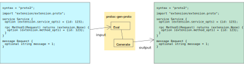

# protoc-gen-proto

<p align="center">
  <a href="README.md">English</a> •
  <a href="README.ja.md">日本語 (Japanese)</a>
</p>

This is protoc plugin template.
The default implementation of plugin generates `.proto` file from `.proto` file.
By generating `.proto` file same with `.proto` file input,
this repository will help understanding how to create new protoc plugin.

<p align="center"></p>

## Tasks

```shell
# generate code
make generated
```

```shell
# run test
make test
```

```shell
# generate testdata
make testdata
```

```shell
# update test expected data
go run ./cmd/protoc-gen-proto < testdata/stdin.bin.pb > testdata/stdout.bin.pb
```

```shell
# formatting .proto files
make format-proto
```
